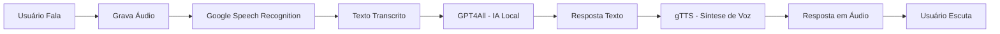

# 🎙️ Assistente de Voz com IA Local (GPT4All)

[](https://colab.research.google.com/drive/18PgBDoIdtpWCV-5wwgtPaE-VzmdbhVnZ?usp=sharing)
[](https://opensource.org/licenses/MIT)
[](https://www.python.org/downloads/)
[](https://colab.research.google.com/)

## 📋 Sobre o Projeto

Este projeto implementa um **Assistente de Voz totalmente gratuito e offline** que permite interagir com uma Inteligência Artificial utilizando apenas comandos de voz. Desenvolvido para o Google Colab, o sistema captura áudio do usuário, transcreve utilizando Google Speech Recognition, processa a pergunta através de um modelo de linguagem local (GPT4All) e retorna a resposta sintetizada em voz.

### ✨ Diferenciais

- 🔒 **100% Privado** - Seus dados não saem do seu ambiente
- 💰 **Completamente Gratuito** - Sem necessidade de API keys ou pagamentos
- 🌐 **Offline (após setup)** - Funciona sem internet após baixar o modelo
- 🎯 **Fácil de usar** - Interface simples e intuitiva
- 🗣️ **Multilíngue** - Suporte nativo para português

## 🎯 Funcionalidades

| Funcionalidade | Descrição |
|----------------|------------|
| 🎤 **Gravação de Áudio** | Captura sua pergunta através do microfone do navegador |
| 📝 **Transcrição Automática** | Converte sua fala em texto usando Google Speech Recognition |
| 🤖 **IA Local (GPT4All)** | Processa sua pergunta sem necessidade de internet (após download) |
| 🔊 **Resposta em Voz** | Sintetiza a resposta da IA em áudio MP3 usando gTTS |
| ⚡ **Processamento Rápido** | Respostas em segundos com modelo otimizado |

## 🛠️ Tecnologias Utilizadas

<div align="center">
  
| Tecnologia | Finalidade |
|------------|------------|
| 🐍 **Python 3.x** | Linguagem principal |
| 📓 **Google Colab** | Ambiente de execução cloud |
| 🧠 **GPT4All** | Modelo de linguagem local (orca-mini-3b) |
| 🎙️ **SpeechRecognition** | Transcrição de áudio |
| 🔊 **gTTS** | Síntese de voz (Text-to-Speech) |
| 🎬 **FFmpeg** | Processamento e conversão de áudio |
| 🌐 **MediaRecorder API** | Captura de áudio no navegador |

</div>

## 📦 Instalação e Execução

### Pré-requisitos

- ✅ Conta no Google (gratuita)
- ✅ Navegador com suporte a microfone (Chrome, Firefox, Edge)
- ✅ Acesso à internet para primeira execução

### 🚀 Passo a Passo

1. **Abra o Google Colab**
   
   Clique no botão abaixo para abrir diretamente no Colab:
   
[](https://colab.research.google.com/drive/18PgBDoIdtpWCV-5wwgtPaE-VzmdbhVnZ?usp=sharing)

2. **Execute as células sequencialmente**
   
   - Clique em `Runtime` → `Run all` ou execute célula por célula com `Shift + Enter`

3. **Permita o acesso ao microfone**
   
   - Quando solicitado, clique em "Permitir" para o Colab acessar seu microfone

4. **Fale sua pergunta**
   
   - O sistema gravará 5 segundos de áudio
   - Fale claramente após o aviso

5. **Aguarde a resposta**
   
   - A IA processará sua pergunta
   - A resposta será exibida em texto e reproduzida em áudio

### ⚙️ Personalização

```python
# Alterar tempo de gravação (padrão: 5 segundos)
record_file = record(sec=10)  # Grava por 10 segundos


# Mudar idioma da resposta
language = 'pt'  # Português
language = 'en'  # Inglês
language = 'es'  # Espanhol
language = 'fr'  # Francês

# Selecionar outro modelo GPT4All
model_name = "ggml-model-gpt4all-falcon-q4_0.gguf"  # Modelo alternativo
```

## 📊 Fluxo de Execução



💬 Exemplo de Uso:

  🎤 Entrada do usuário (voz)
  "Qual é a capital do Brasil?"

  💬 Resposta do sistema (texto e voz)
  "A capital do Brasil é Brasília, localizada na região Centro-Oeste do país. 
  Foi inaugurada em 1960 e é conhecida por sua arquitetura moderna 
  projetada por Oscar Niemeyer."

📁 Estrutura do Projeto

├── Assistente_de_Voz_Multi_Idiomas_Com_Whisper_e_ChatGPT.ipynb  # Notebook principal
├── README.md                                                     # Documentação
├── LICENSE                                                       # Licença MIT
└── requirements.txt                                              # Dependências

⚠️ Observações Importantes
Atenção	Detalhe
📥 Primeira execução	O modelo GPT4All (~4GB) será baixado automaticamente. Pode levar vários minutos.
💾 Memória RAM	Recomendado mínimo de 8GB para execução suave.
🎙️ Microfone	Necessário permitir acesso no navegador quando solicitado.
⏰ Sessão Colab	O Google Colab desconecta após inatividade prolongada. Salve seu progresso!
🚧 Melhorias Futuras
Implementar gravação contínua com detecção de silêncio

Adicionar interface gráfica com Gradio

Criar versão desktop standalone

Adicionar cache de respostas para perguntas frequentes

Implementar modo conversação contínua

Suporte a mais modelos de linguagem

📚 Referências e Recursos
GPT4All Documentation

Google Speech Recognition

gTTS Documentation

Google Colab

Modelos GPT4All Disponíveis

👨‍💻 Autor
Marcus Paiva

GitHub: https://github.com/marcuspaiv
Linkedin: https://www.linkedin.com/in/marcus-paiva-b10339186/

📄 Licença
Este projeto está sob a licença MIT. Veja o arquivo LICENSE para mais detalhes.

🌟 Dê uma estrela!
Se este projeto foi útil para você, considere dar uma ⭐ no GitHub! Isso me ajuda a saber que estou no caminho certo.

<div align="center">
Feito com ☕ e Python

⬆ Voltar ao topo

</div> ```
